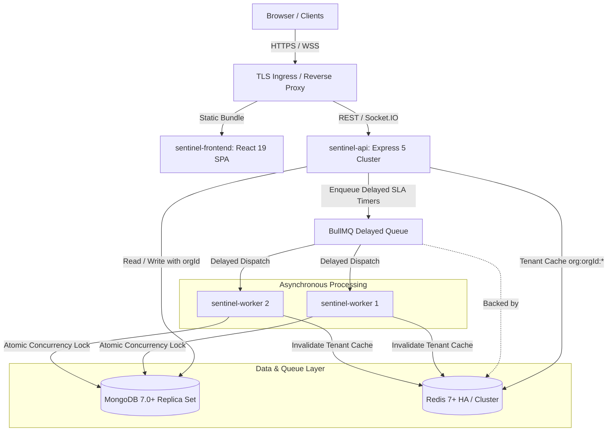
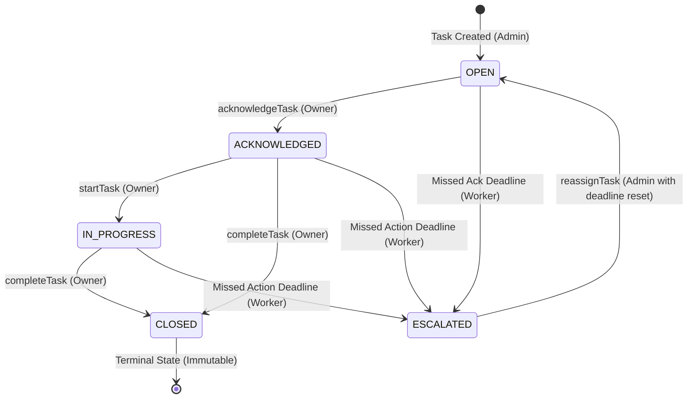

# Sentinel

> Production-style, multi-tenant task governance SaaS platform with automated SLA escalation, centralized state machine enforcement, distributed worker scaling, and zero-leakage tenant isolation.

---

## Table of Contents
- [Problem](#problem)
- [Architecture](#architecture)
- [Key Engineering Challenges](#key-engineering-challenges)
- [Multi-Tenancy & Security Isolation](#multi-tenancy--security-isolation)
- [Centralized Task State Machine](#centralized-task-state-machine)
- [Distributed SLA Escalation & BullMQ](#distributed-sla-escalation--bullmq)
- [Distributed Worker Scaling](#distributed-worker-scaling)
- [Reliability & Failure Recovery](#reliability--failure-recovery)
- [Performance & Benchmark Results](#performance--benchmark-results)
- [Observability & Telemetry](#observability--telemetry)
- [Testing & Quality Gates](#testing--quality-gates)
- [CI/CD Pipeline](#cicd-pipeline)
- [Docker Architecture](#docker-architecture)
- [Local Development Setup](#local-development-setup)
- [Production Deployment](#production-deployment)
- [Engineering Trade-offs](#engineering-trade-offs)
- [AI Operations Assistant (IBM watsonx)](#ai-operations-assistant-ibm-watsonx)
- [Known Limitations & Future Work](#known-limitations--future-work)

---

## Problem

In enterprise task governance and SLA compliance platforms, standard CRUD architectures consistently succumb to three critical production failure modes:
1. **Unreliable SLA Tracking**: Relying on database polling loops (`setInterval`) burns CPU/IOPS and creates race conditions when horizontally scaling across multiple API nodes.
2. **State Machine Corruption**: Ad-hoc controller mutations (`task.state = 'CLOSED'`) allow illegal transitions, bypass audit trails, and reopen terminal records.
3. **Cross-Tenant Data Leakage**: Trusting client-supplied organization IDs in request bodies or query parameters introduces severe IDOR vulnerabilities and cache-poisoning risks.

Sentinel resolves these issues through a backend-first architecture featuring centralized state validation, Redis/BullMQ distributed delay queues, optimistic version locking, and strict tenant boundaries.

---

## Architecture



---

## Key Engineering Challenges

1. **At-Least-Once Execution with Strict Idempotency**: Ensuring that when duplicate delayed jobs are delivered across distributed workers, exactly one transition occurs with zero duplicate audit events.
2. **Elimination of N+1 Aggregation Latency**: Transforming an $O(N)$ dashboard query loop that issued 361 queries into a single batch MongoDB aggregation pipeline.
3. **Optimistic Version Locking**: Incrementing `slaVersion` on task mutations so that obsolete BullMQ delayed jobs are safely dropped in $O(1)$ time upon execution.
4. **Resilient Decoupled Probes**: Decoupling `/health` (process liveness) from `/ready` (dependency validation) to prevent cascading restart storms in container orchestrators.

---

## Multi-Tenancy & Security Isolation

Sentinel employs a **logical multi-tenancy model**:
- **Trusted Context Derivation**: Organization identity is derived exclusively from cryptographically signed JWT claims (`req.user.orgId`) via `attachTenantContext`. Client-supplied tenant IDs in bodies, queries, or headers are intercepted; mismatches are rejected with `HTTP 403 Forbidden`.
- **Query Scoping**: Every MongoDB operation includes `{ orgId: req.orgId }`.
- **Cache Isolation**: Keys are prefixed as `org:{orgId}:{resource}`. Cross-tenant reads and overwrites are structurally impossible.
- **WebSocket Rooms**: Socket.IO broadcasts are scoped to tenant rooms (`io.to('org:orgId')`).

---

## Centralized Task State Machine

Task transitions are validated through a centralized Directed Acyclic Graph (DAG) in [`taskStateMachine.service.js`](backend/src/services/taskStateMachine.service.js):



- **Terminal CLOSED**: Once closed, tasks can never be transitioned or modified (`HTTP 409 Conflict`).
- **Immutable Audit Trail**: Every transition generates a persistent `TaskStateTransition` document recording `fromState`, `toState`, `triggeredBy` (`USER`/`ADMIN`/`SYSTEM`), and `actor`.

---

## Distributed SLA Escalation & BullMQ

Instead of scanning the database with periodic intervals, Sentinel schedules delayed timers in Redis:
1. When a task is created with `ackDeadline`, BullMQ enqueues a job delayed by $\Delta t = \text{ackDeadline} - \text{now}$.
2. **Deterministic Job IDs**: `ack:<taskId>:<slaVersion>` guarantees deduplication.
3. **Stale Job Protection**: If a task is acknowledged early or reassigned, `slaVersion` increments. When the delayed job fires, the worker verifies `task.slaVersion === job.data.slaVersion`. Stale jobs are discarded without action.

---

## Distributed Worker Scaling

SLA escalation processing is fully decoupled from the API:
- **Atomic Concurrency Lock**: Distributed workers compete to escalate via:
  ```javascript
  Task.findOneAndUpdate(
    { _id: task._id, orgId: task.orgId, state: { $in: eligibleStates }, slaVersion: task.slaVersion },
    { $set: { state: 'ESCALATED', owner: admin._id } }
  )
  ```
- **Horizontal Scaling Benchmark**: Tested across 1, 2, and 3 worker processes processing 600 burst overdue tasks; verified **zero duplicate escalations** with uniform job distribution (299 / 301 on 2 workers).

---

## Reliability & Failure Recovery

- **Redis Outage**: `/ready` returns `503 Service Unavailable`, prompting load balancers to halt traffic. The caching service gracefully falls back to MongoDB so active reads continue.
- **MongoDB Outage**: `/ready` returns `503`. The API does not falsely report ready.
- **Worker Crash**: BullMQ locks expire after 30 seconds; pending jobs are safely reclaimed by surviving workers.
- **Graceful Shutdown**: Intercepts `SIGINT`/`SIGTERM`, stops accepting new connections, and provides a 10-second drain window for active requests and jobs.

---

## Performance & Benchmark Results

*Measured on 50,000 tasks, 100,000 transitions across 12 organizations on MongoDB 8.0.8 & Redis 8.10.1.*

| Benchmark Dimension | Baseline (Before) | Optimized (After) | Improvement |
|---|---|---|---|
| **Admin Task Listing** | 491 ms (COLLSCAN + in-memory sort) | **1 ms** (Compound IXSCAN) | **99.8% reduction** |
| **Filtered Task Listing** | 120 ms (In-memory sort) | **2 ms** (Compound IXSCAN) | **98.3% reduction** |
| **Member Performance Queries**| 361 queries ($3N+1$ loop) | **2 queries** (Batch aggregation) | **99.4% fewer queries** |
| **Member Performance Latency**| 768 ms | **99 ms** | **87.1% reduction** |
| **Dashboard Summary Cache Hit**| 59 ms (Database) | **1.1 ms** (Redis) | **98.1% reduction** |
| **k6 Peak Throughput (100 VUs)**| N/A | **934.8 RPS** (p95: 89ms) | **0.00% errors** |
| **Worker Concurrency (c=10)** | 164.3 jobs/sec (c=1) | **465.1 jobs/sec** (c=10) | **183% increase** |

---

## Observability & Telemetry

- **Structured JSON Logging**: Winston emits structured JSON containing `requestId`, `orgId`, `userId`, `service`, and `durationMs`.
- **Prometheus Metrics (`GET /metrics`)**:
  - `sentinel_http_requests_total`, `sentinel_http_request_duration_seconds`
  - `sentinel_tasks_created_total`, `sentinel_tasks_completed_total`, `sentinel_tasks_escalated_total`
  - `sentinel_worker_jobs_total`, `sentinel_worker_job_duration_seconds`, `sentinel_worker_job_failures_total`
  - `sentinel_cache_hits_total`, `sentinel_cache_misses_total`
- **Health Checks**:
  - `GET /health` (Process Liveness)
  - `GET /ready` (Dependency Readiness: MongoDB & Redis)

---

## Testing & Quality Gates

Sentinel enforces a strict **110-test automated regression suite** running on Node.js's native test runner:

```text
ℹ tests 110
ℹ suites 46
ℹ pass 110
ℹ fail 0
ℹ cancelled 0
ℹ skipped 0
ℹ duration_ms 21980.5609
```

- **Linters**: 0 ESLint errors, 0 ESLint warnings (`backend` and `frontend`).
- **Deployment Smoke Test**: 7/7 passing tests verifying health, auth, CRUD, queues, and sockets in 584ms.
- **Resilience Outage Test**: 4/4 passing tests verifying recovery from simulated Redis and MongoDB downtime.
- **CI Performance Smoke**: Runs in 25ms in CI verifying IXSCAN index usage and sub-10ms cache latency.

---

## CI/CD Pipeline

Codified in [`.github/workflows/ci.yml`](.github/workflows/ci.yml):
- Runs on every push and pull request against `main`.
- Provisons containerized MongoDB 7.0 and Redis 7 Alpine services.
- Executes `npm ci` $\rightarrow$ `npm audit --audit-level=critical` $\rightarrow$ ESLint $\rightarrow$ 110-test suite $\rightarrow$ CI Performance Smoke $\rightarrow$ Frontend Build $\rightarrow$ Service Startup Validation $\rightarrow$ Docker Multi-Stage Image Builds.

---

## Docker Architecture

Decoupled multi-stage production images running under unprivileged user `node` (UID 1000):
- `sentinel-api`: Express API runtime with `/ready` curl healthcheck.
- `sentinel-worker`: Isolated BullMQ worker runtime.
- `sentinel-frontend`: Nginx Alpine serving optimized production bundle with `/healthz` check.
- `sentinel-mongodb`: Official Mongo 7.0 with native ping check.
- `sentinel-redis`: Official Redis 7 with AOF/RDB persistence and ping check.

---

## Local Development Setup

### Prerequisites
- Node.js v20+ or v24+
- MongoDB v7+ (running locally on port 27017)
- Redis v7+ (running locally on port 6379)

### Installation
```bash
# 1. Clone repository
git clone https://github.com/shravani-hiregowda/Sentinel.git
cd Sentinel/sentinel

# 2. Install dependencies
npm --prefix backend install
npm --prefix frontend install

# 3. Provision environment files
cp backend/.env.example backend/.env

# 4. Synchronize database indexes
npm --prefix backend run db:init-indexes

# 5. Seed development data
npm --prefix backend run seed

# 6. Start API server and Worker (separate terminals)
npm --prefix backend run dev
npm --prefix backend run worker

# 7. Start frontend
npm --prefix frontend run dev
```

---

## Production Deployment

### Docker Compose Stack
```bash
cp .env.production.example .env
docker compose up -d --build
docker compose ps
```

### Scale Workers Horizontally
```bash
docker compose up -d --scale worker=3
```

---

## Engineering Trade-offs

| Decision | Chosen Approach | Alternative | Why We Made This Choice |
|---|---|---|---|
| **Queue Engine** | BullMQ + Redis | Apache Kafka | BullMQ natively supports arbitrary future delay timers without complex topic partitioning or ZooKeeper/KRaft overhead. |
| **SLA Scheduling** | Delayed Jobs | `setInterval` Polling | Eliminates constant database polling overhead; triggers precisely when deadlines expire. |
| **Tenancy Model** | Logical Pooled | Database-per-tenant | Maximizes resource utilization and simplifies index/schema migrations while preserving strict software isolation. |
| **State Machine** | Centralized Service | Mongoose Hooks | Prevents hidden hook side-effects; guarantees audit logging, cache invalidation, and metrics execute in one predictable transaction. |
| **Worker Scaling**| Decoupled Container | Monolithic Process | Allows workers to scale on queue backlog while API scales on HTTP request traffic; isolates worker crashes from user traffic. |

---

## AI Operations Assistant (IBM watsonx)

Sentinel features an optional, enterprise AI Operations Assistant powered by **IBM watsonx.ai** (`/ml/v1/chat/completions`) that enables operators to query task states, analyze SLA breaches, and perform controlled task actions in natural language.

### Core Security Principles
* **Additive Integration**: Sentinel's existing backend remains the single source of truth for Auth, RBAC, tenant isolation, and task state.
* **No Direct Database Access**: The LLM has zero direct database credentials or query privileges. It interacts exclusively via an allowlisted function-calling interface.
* **Zero Trust Tenancy**: The server derives `orgId` strictly from the verified JWT token (`req.user.orgId`). Any client/prompt attempts to access or spoof other tenants are systematically ignored.
* **State Machine & Audit Enforcement**: Task mutations (e.g. `acknowledgeTask`) invoke Sentinel's centralized `transitionTask` engine and record immutable entries in `AuditLog`.
* **Optional & Resilient**: AI provider downtime or unconfigured credentials never impact core task creation, SLA escalation workers, or dashboards (graceful degradation with HTTP 503).

### Allowlisted AI Tools
- `getTasks`: Query organization tasks filtered by state or owner.
- `getOverdueTasks`: List tasks breaching ACK or Action deadlines.
- `getEscalatedTasks`: Retrieve escalated tasks and historical escalation reasons.
- `getTaskDetails`: Detailed task state and SLA deadlines.
- `getTaskSLAHistory`: Chronological state transitions and escalation events.
- `getTeamPerformance`: Aggregated completion rates and overdue counts per member.
- `createTask` (**ADMIN only**): Create new tasks with SLA deadlines; creates `AuditLog`.
- `acknowledgeTask` (**Owner/ADMIN only**): Validates ownership and executes state transition to `ACKNOWLEDGED`.

---

## Known Limitations & Future Work

1. **Single-Primary Write Contention**: High write concurrency (> 500 writes/sec) is bounded by MongoDB primary lock throughput. Future scaling involves sharding by `orgId`.
2. **WebSocket Cross-Node Synchronization**: Current Socket.IO instances broadcast in-process. Multi-node API deployments will implement `@socket.io/redis-adapter`.
3. **Distributed Tracing**: Structured logs carry correlation IDs (`requestId`); full distributed spans will be introduced via OpenTelemetry.

---

## Documentation Index
- [Architecture Specification](docs/architecture.md)
- [IBM watsonx AI Assistant Specification](docs/ai-assistant.md)
- [Engineering Decisions Record](docs/engineering-decisions.md)
- [Technical Interview Defense Guide](docs/interview-guide.md)
- [Resume & Portfolio Evidence](docs/resume-evidence.md)
- [Production Deployment Guide](docs/deployment.md)
- [Production Readiness Checklist](docs/production-checklist.md)
- [CI/CD Pipeline Guide](docs/ci-cd.md)
- [Rollback Playbook](docs/rollback.md)
- [Phase 4 Performance Report](docs/phase4-performance-report.md)
- [Phase 5 Production Readiness Report](docs/phase5-production-readiness.md)
- [Phase 6 Final Validation Report](docs/phase6-final-validation.md)