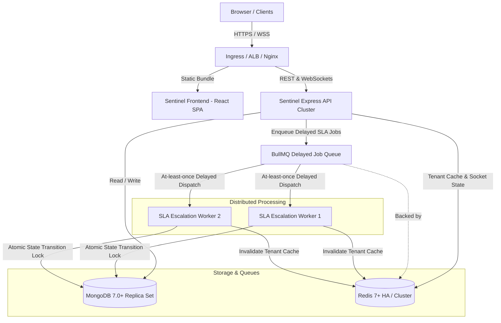
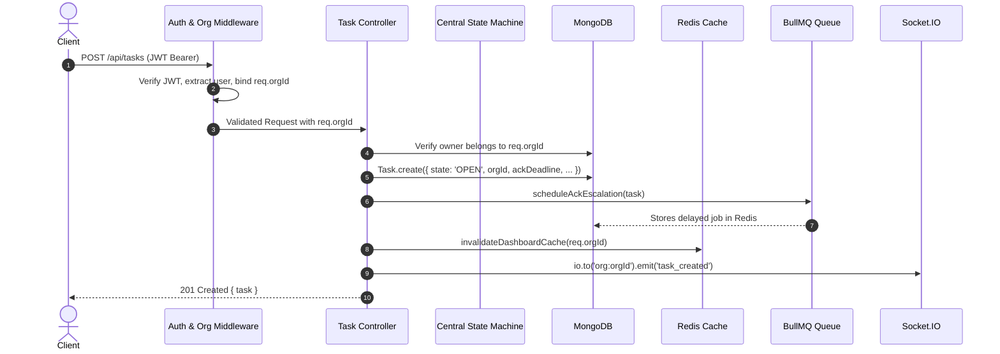
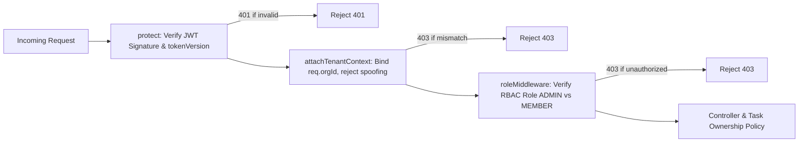
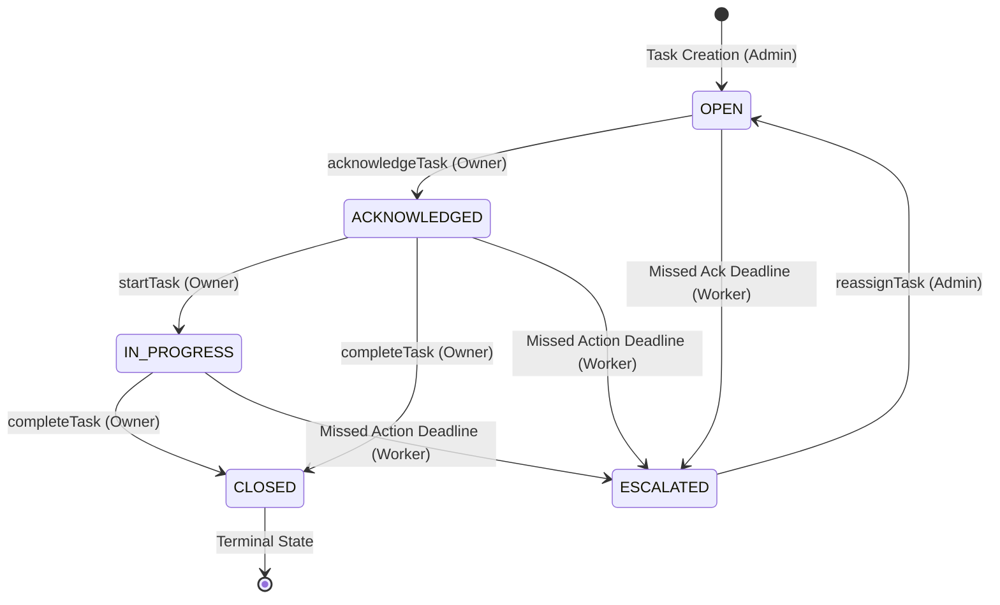
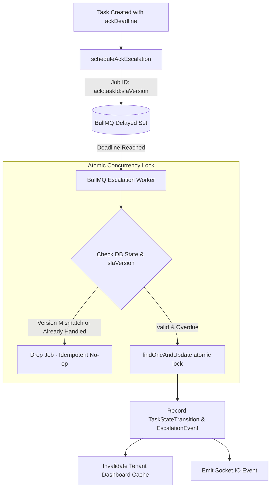
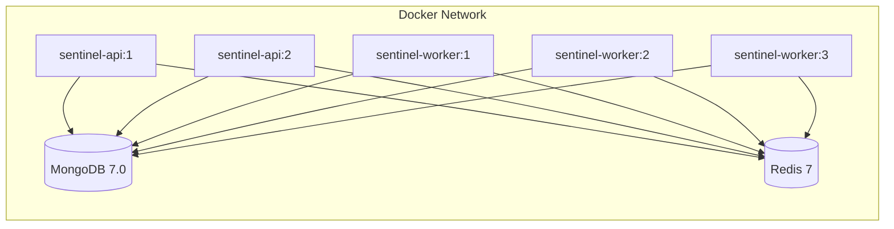

# Sentinel — System Architecture & Design Specification

## 1. System Overview

Sentinel is a production-style, multi-tenant SaaS task-governance platform. It provides deterministic task lifecycle state management, distributed SLA escalation tracking, optimistic version concurrency, and tenant-scoped caching with strict data isolation.



---

## 2. Core Components

1. **Frontend (`sentinel-frontend`)**: React 19 single-page application served via Nginx with GZIP compression, custom theme CSS variables, and real-time Socket.IO subscriptions.
2. **API Layer (`sentinel-api`)**: Express 5 application handling authentication, tenant context injection, input validation, state machine dispatch, and Prometheus metric emission.
3. **Primary Store (MongoDB)**: Houses `Task`, `User`, `Membership`, `TaskStateTransition`, `EscalationEvent`, and `AuditLog` documents with 37 compound indexes.
4. **Cache & Queue Broker (Redis)**: Serves two distinct functions:
   - Tenant-isolated caching (`org:{orgId}:*`) with sub-millisecond read latency.
   - Distributed delay-queue backing store for BullMQ SLA timers.
5. **Distributed Workers (`sentinel-worker`)**: Standalone BullMQ worker processes executing SLA deadline checks with atomic concurrency locks and idempotent state transitions.

---

## 3. End-to-End Request & Data Flow



---

## 4. Authentication & Authorization Boundaries

Authentication and authorization are separated into distinct middlewares:



- **Authentication (`protect`)**: Verifies signature with `JWT_SECRET`, decodes payload, and checks that `user.isActive === true` and `user.tokenVersion` matches the token.
- **Tenant Context (`attachTenantContext`)**: Extracts `req.user.orgId`. Inspects `req.body`, `req.query`, and `req.params`. If a client passes an `orgId` that does not match `req.user.orgId`, the request is blocked immediately with `403 Forbidden`. Overwrites `req.body.orgId` with `req.user.orgId`.
- **RBAC (`authorize`, `adminOnly`)**: Enforces hierarchical role access (`ADMIN` vs `MEMBER`).

---

## 5. Multi-Tenant Data Isolation Strategy

Sentinel uses a **pooled logical multi-tenancy model**:
- **At Rest**: Every document across all collections stores an immutable `orgId: ObjectId`.
- **In Transit**: Every database query, aggregation `$match`, and update strictly includes `{ orgId: req.orgId }`.
- **In Cache**: All cache keys follow the strict namespace convention:
  $$\text{Key} = \text{org}:\{\text{orgId}\}:\{\text{resourceName}\}$$
- **In Events**: Socket.IO rooms are partitioned by tenant: `io.to('org:orgId')`.

---

## 6. Centralized Task State Machine

Task transitions are strictly validated and managed via [`backend/src/services/taskStateMachine.service.js`](file:///d:/Sentinel/sentinel/backend/src/services/taskStateMachine.service.js). Direct mutations of `task.state` outside of this service and `escalationService` are forbidden.



### Transition Validation Rules
1. **Valid Transitions**:
   - `OPEN` $\rightarrow$ `ACKNOWLEDGED`, `ESCALATED`
   - `ACKNOWLEDGED` $\rightarrow$ `IN_PROGRESS`, `CLOSED`, `ESCALATED`
   - `IN_PROGRESS` $\rightarrow$ `CLOSED`, `ESCALATED`
   - `ESCALATED` $\rightarrow$ `OPEN` (Admin reassignment with deadline reset)
2. **Terminal State**: `CLOSED` is permanently terminal. Any attempt to transition or reassign a closed task throws an `HTTP 409 Conflict`.
3. **Immutable History**: Every state transition creates an audit record in `TaskStateTransition` with `orgId`, `taskId`, `fromState`, `toState`, `triggeredBy` (`USER`/`ADMIN`/`SYSTEM`), and `actor`.

---

## 7. Distributed SLA Escalation Architecture



### SLA Escalation Principles
1. **Deterministic Job IDs**: Formatted as `ack:<taskId>:<slaVersion>` and `action:<taskId>:<slaVersion>`. Guarantees at-most-one scheduled job per task version.
2. **SLA Versioning (`slaVersion`)**: Every time a task is reassigned or deadlines are reset, `task.slaVersion` is incremented. When an old delayed job becomes runnable, the worker loads the task; if `task.slaVersion !== job.data.slaVersion`, the job is discarded as stale.
3. **Atomic Concurrency Lock**: Distributed workers compete to escalate via:
   ```javascript
   Task.findOneAndUpdate(
     { _id: task._id, orgId: task.orgId, state: { $in: eligibleStates }, slaVersion: task.slaVersion },
     { $set: { state: 'ESCALATED', owner: admin._id } },
     { new: false }
   )
   ```
   If two workers process the same task simultaneously, MongoDB's document-level lock guarantees exactly one write succeeds. The loser receives `null` and exits with zero side effects.
4. **Idempotency Guarantee**: **At-least-once job execution with strictly idempotent state transitions**.

---

## 8. Database Indexing Strategy

Phase 4 query audits with `explain('executionStats')` eliminated all `COLLSCAN` and in-memory `SORT` operations on production queries:

| Collection | Compound Index Key | Query Pattern Supported | Benefit |
|---|---|---|---|
| `Task` | `{ orgId: 1, updatedAt: -1 }` | Admin task listing & pagination | In-memory sort removed; 491ms $\rightarrow$ 1ms |
| `Task` | `{ orgId: 1, state: 1, updatedAt: -1 }` | State-filtered task listing | Scans exactly $N$ returned docs; 120ms $\rightarrow$ 2ms |
| `Task` | `{ orgId: 1, owner: 1, updatedAt: -1 }` | Member task listing | Direct index scan on tenant + owner |
| `Task` | `{ orgId: 1, state: 1 }` | Dashboard KPI count queries | Index-only key counting |
| `Task` | `{ orgId: 1, ackDeadline: 1 }` | SLA overdue queries | Eliminates full collection scans |
| `Membership` | `{ userId: 1, organizationId: 1 }` | Unique membership lookups | Fast authorization checks |
| `TaskStateTransition` | `{ orgId: 1, task: 1, createdAt: 1 }` | Task audit timeline | Chronological sorting without memory sort |

---

## 9. Tenant-Scoped Redis Caching & Invalidation

1. **Read Path**: The API queries `org:{orgId}:{resource}`. On hit, returns in ~1ms without database load.
2. **Write Path / Invalidation**:
   - `createTask` $\rightarrow$ `invalidateDashboardCache(orgId)`
   - `transitionTask` $\rightarrow$ `invalidateDashboardCache(orgId)`
   - `processTaskEscalation` $\rightarrow$ `invalidateDashboardCache(orgId)`
3. **Invalidation Engine**: Uses Redis `SCAN` with pattern `org:{orgId}:dashboard:*` to safely delete tenant keys without blocking the Redis event loop.

---

## 10. Observability & Telemetry

- **Structured JSON Logging**: Every log emitted via Winston includes `timestamp`, `level`, `service`, `environment`, and correlation IDs (`requestId`, `orgId`, `userId`).
- **Prometheus Metrics (`/metrics`)**:
  - `sentinel_http_requests_total`, `sentinel_http_request_duration_seconds`
  - `sentinel_tasks_created_total`, `sentinel_tasks_completed_total`, `sentinel_tasks_escalated_total`
  - `sentinel_worker_jobs_total`, `sentinel_worker_job_duration_seconds`, `sentinel_worker_job_failures_total`
  - `sentinel_cache_hits_total`, `sentinel_cache_misses_total`
- **Health Probes**:
  - `GET /health` (Process Liveness, uptime, 0ms latency)
  - `GET /ready` (Dependency Readiness: checks MongoDB and Redis connectivity)

---

## 11. Docker & Horizontal Scaling



- **Independent Autoscaling**: API scales with incoming HTTP requests; Workers scale horizontally against BullMQ queue depth.
- **Worker Concurrency Sweet-Spot**: Phase 4 measured worker concurrency 10 as optimal (465 jobs/sec), with concurrency 20 showing lock contention on single MongoDB primaries.
